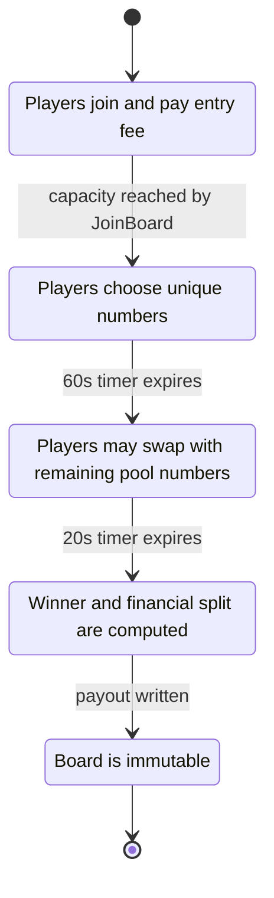
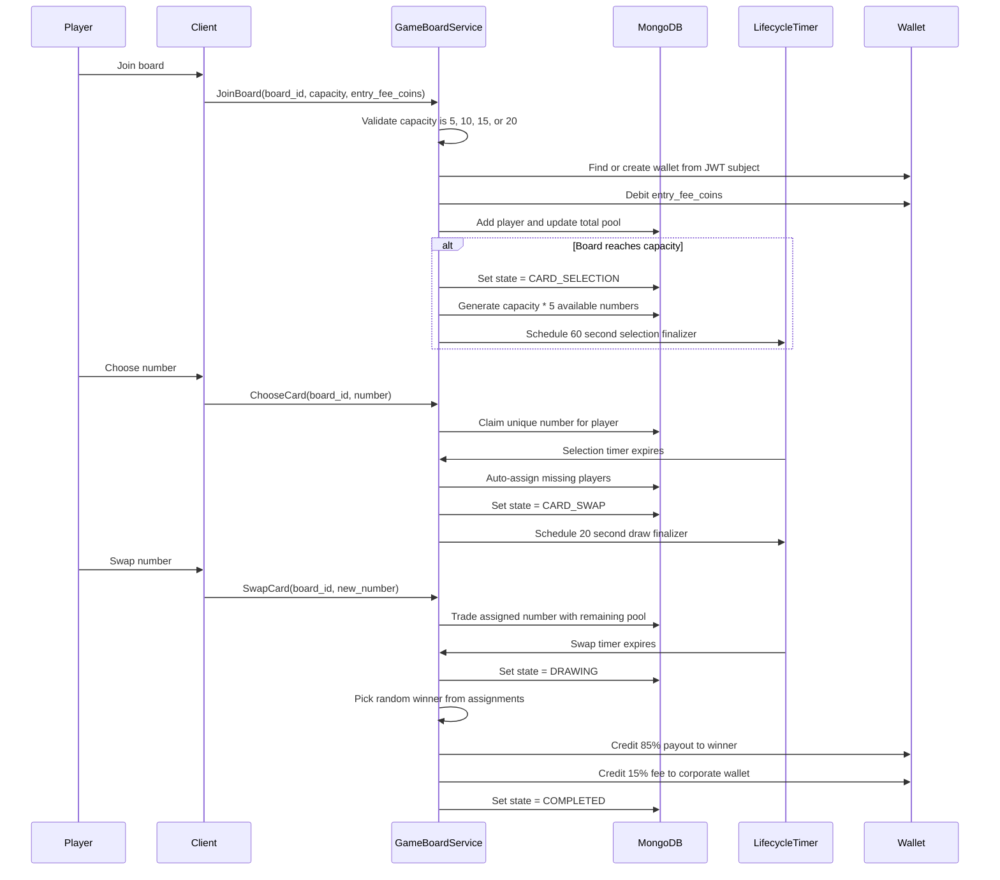

# Game Board Flow

This document describes the gRPC game board lifecycle implemented by `GameBoardServiceImpl`.

## State Machine



## End-To-End Sequence



## State Details

| State | Trigger | Allowed gRPC calls | Timeout | Writes |
| --- | --- | --- | --- | --- |
| `OPEN` | Board is created or waiting for capacity | `JoinBoard`, `GetBoardState` | None | `gameboards`, `userwallets`, `walletledger` |
| `CARD_SELECTION` | `JoinBoard` fills board capacity | `ChooseCard`, `GetBoardState` | 60 seconds | card pool, assignments |
| `CARD_SWAP` | Selection timer expires | `SwapCard`, `GetBoardState` | 20 seconds | assignments, remaining pool |
| `DRAWING` | Swap timer expires | `GetBoardState` | Immediate internal transition | winner and payout fields |
| `COMPLETED` | Payout writes finish | `GetBoardState` | None | final immutable result |

## gRPC Contract

Proto file:

```text
src/main/proto/gameboard.proto
```

Service:

```text
gameboard.v1.GameBoardService
```

Generated Java package:

```text
com.lottowin.game.grpc
```

## JoinBoard

Request:

```json
{
  "board_id": "6652ca0d2bd9d16f4a9ef001",
  "capacity": 5,
  "entry_fee_coins": 100
}
```

Rules:

- `board_id` must be a MongoDB ObjectId string.
- `capacity` must be `5`, `10`, `15`, or `20`.
- `entry_fee_coins` must be positive.
- The authenticated user comes from JWT `sub`.
- The wallet is created from JWT `wallet_balance` if it does not already exist.
- The mutable wallet balance is read from MongoDB.
- If balance is insufficient, the join is rejected.
- If the board reaches capacity, the service enters `CARD_SELECTION`.

## ChooseCard

Request:

```json
{
  "board_id": "6652ca0d2bd9d16f4a9ef001",
  "number": 7
}
```

Rules:

- Only players already in the board can choose.
- Board state must be `CARD_SELECTION`.
- The call must happen before the 60 second timer expires.
- A player can choose only once.
- The chosen number must exist in `available_numbers`.

## Auto Allocation

When the selection timer expires:

- The service loops through all players.
- Any player without an assignment receives a random remaining number.
- The board moves to `CARD_SWAP`.
- A 20 second swap timer is scheduled.

This recovery is also re-scheduled at application startup for boards already in `CARD_SELECTION`.

## SwapCard

Request:

```json
{
  "board_id": "6652ca0d2bd9d16f4a9ef001",
  "new_number": 12
}
```

Rules:

- Only players already in the board can swap.
- Board state must be `CARD_SWAP`.
- The call must happen before the 20 second timer expires.
- The player must already have an assigned number.
- The requested new number must still be in the unselected pool.
- The player's old number returns to the available pool.

## Draw And Payout

When the swap timer expires:

- Board state moves to `DRAWING`.
- A winner is selected from `player_assignments`.
- Platform fee is computed as `total_pool_coins * 15 / 100`.
- Winner payout is `total_pool_coins - platform_fee_coins`.
- Winner wallet is credited with the 85% payout.
- Corporate wallet id `corporate-wallet` is credited with the 15% fee.
- Ledger entries are written for winner payout and platform fee.
- Board state moves to `COMPLETED`.

This recovery is also re-scheduled at application startup for boards already in `CARD_SWAP`.

## BoardStateReply

Every gRPC method returns the same board snapshot shape:

```json
{
  "board_id": "6652ca0d2bd9d16f4a9ef001",
  "state": "CARD_SELECTION",
  "capacity": 5,
  "entry_fee_coins": 100,
  "players": ["user-1", "user-2"],
  "available_numbers": [1, 2, 3, 4],
  "assignments": [
    {
      "user_id": "user-1",
      "number": 7
    }
  ],
  "winning_number": 0,
  "winner_user_id": "",
  "total_pool_coins": 500,
  "platform_fee_coins": 0,
  "winner_payout_coins": 0,
  "message": "Card selected successfully."
}
```

## Security

All methods require:

```java
@RolesAllowed("user")
```

JWT requirements:

- `sub`: user id
- `wallet_balance`: initial wallet balance claim
- `realm_access.roles`: contains `user`

In `%dev`, Quarkus authorization can be bypassed and the service falls back to:

```properties
%dev.lottowin.dev-user-id=dev-user
%dev.lottowin.dev-wallet-balance-coins=100000
```

## Important Production Note

Board and payment locks are JVM-local. Before horizontally scaling multiple instances that can mutate the same board id or Razorpay order id, replace these locks with distributed locking, partition board ownership, or MongoDB atomic update filters.
